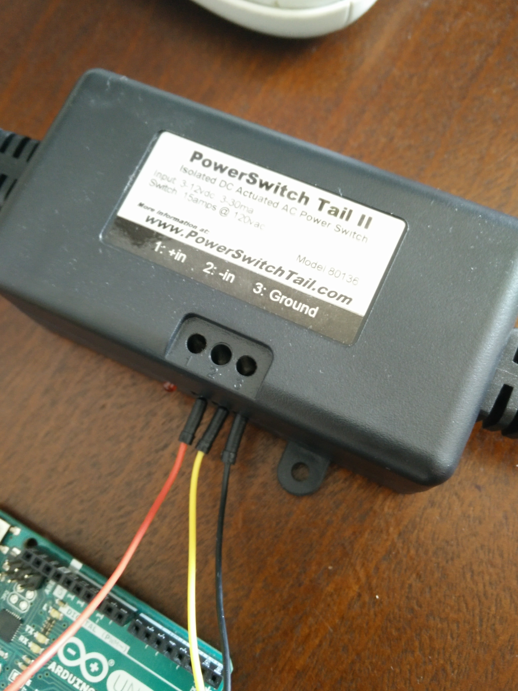
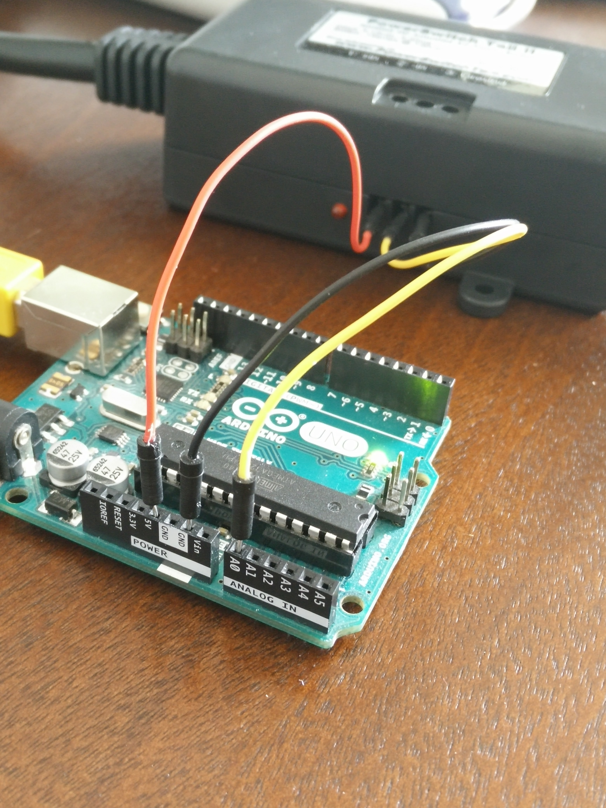
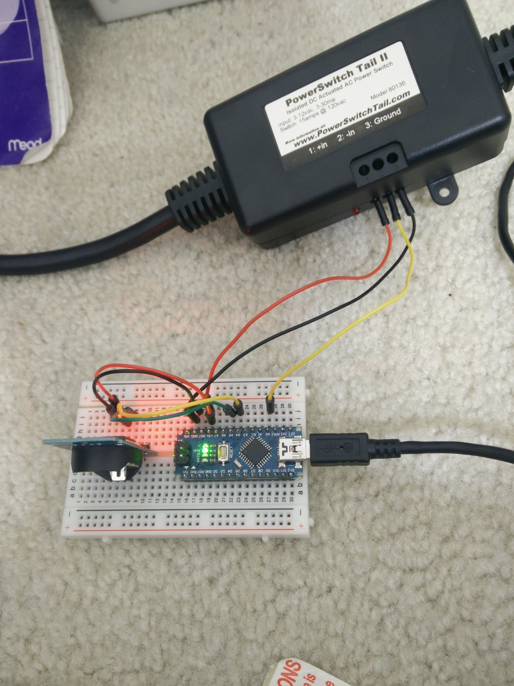
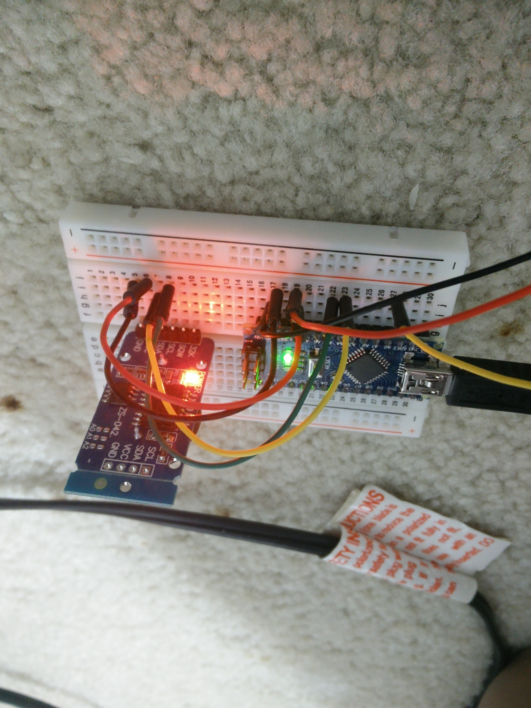

# RTC_Alarm_Clock
This Arduino project is an alarm clock build that turns on a lamp inside of my room at a certain time, which would be the time I wake up at. The build includes the use of a product called the PowerSwitch Tail 2, which can be bought at their website

http://www.powerswitchtail.com/

# notes
The timing on when the lamp should turn on is not accurate right now. I need to do some debugging to see what the issue is. Right now I'm thinking that the problem is that I accidentally configured the initialized time to some wrong date and time.
Other potential problems could be that the conversions to military time are wrong, or I just input the wrong number at the if statements that control turnOn() and turnOff()

below are some photos of the build and the powerswitch tail

  
  

